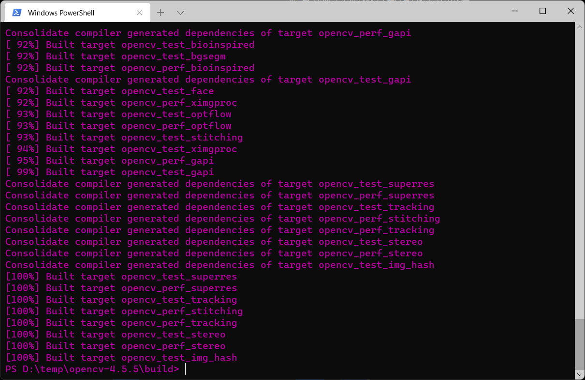
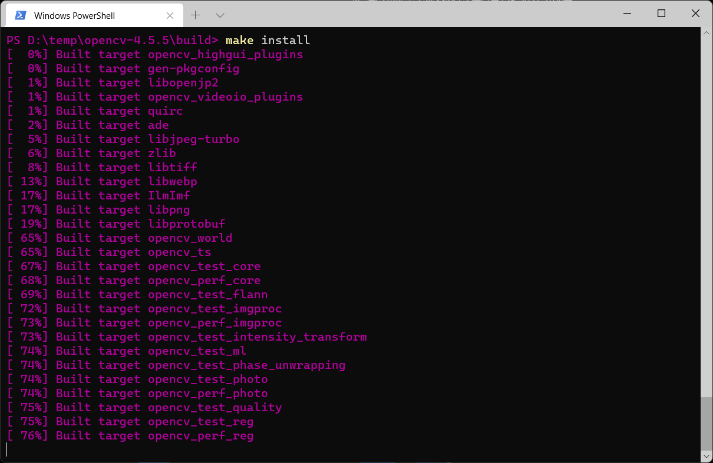
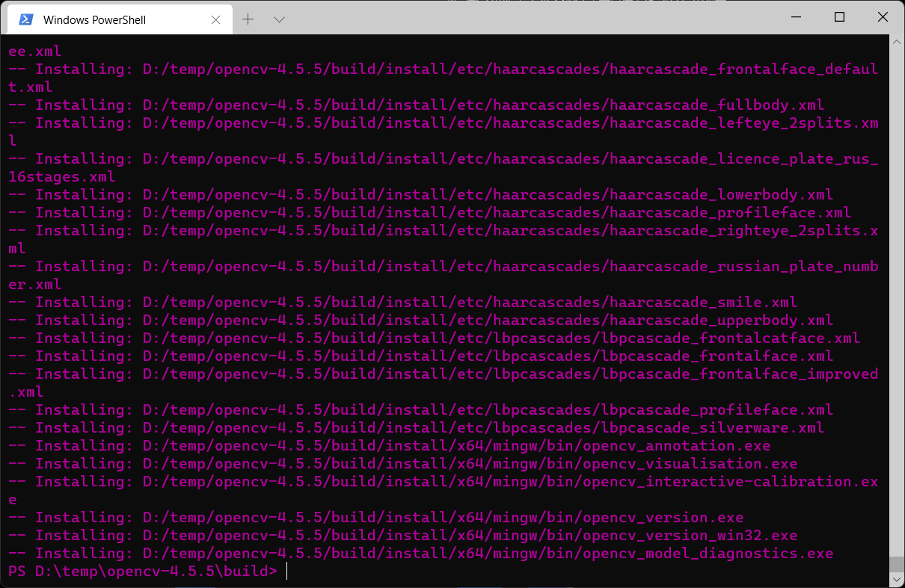
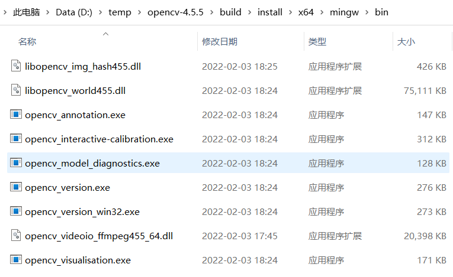
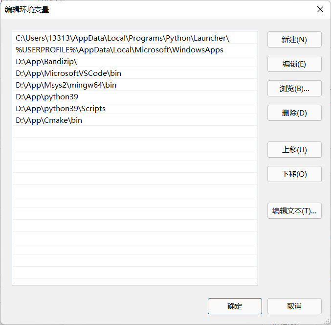

 ## Linux

- **从源码编译安装opencv**

  首先安装opencv需要的依赖包和软件，随便打开一个终端，输入：

  ```shell
  posi
  ```

  到opencv的官网下载你需要安装的opencv版本与**相同版本**的contrib包，并解压到home文件夹，并将contrib文件夹移入刚刚opencv源码的文件夹中。

  进入opencv文件夹，右击空白处，打开一个新的终端，输入：

  ```shell
  mkdir build
  cd build
  cmake-gui ..
  ```

  便打开了cmake的图形界面

  


- **利用openvino自带的opencv**

  进入intel openvino的官方网站：[下载英特尔® 发行版 OpenVINO™ 工具套件 (intel.cn)](https://www.intel.cn/content/www/cn/zh/developer/tools/openvino-toolkit-download.html)（即使你使用的是AMD的芯片，仍然可以通过此方式安装opencv，只不过你无法使用openvino的推理框架，因为有一些算子不被处理器或指令集支持）

  > 2022.7.2更新：在AMD更新了对AVX512的支持后，大部分模型都可以在AMD处理器上进行推理！

  如图所示，在左侧选择系统和发行版本，邮箱随便填一个然后就可以开始下载安装包了。
  
  

  注意选择2021.4.2 LTS版本的**离线安装程序**，最新的版本都是通过python的包管理器pip或者conda安装的，默认不附带opencv（当然也提供了脚本帮助安装，但不如前者来的方便）。
  
  下载完成后，就地解压，进入解压缩后的文件夹，右键空白处打开一个终端，输入：
  
  ```shell
  sudo ./install_GUI.sh
  ```
  
  便进入安装程序的图形界面。
  
  如果是新手，请按照默认配置一路往下安装，不要修改其他选项。注意若提醒没有安装cmake 3.16以上的版本，打开一个终端，输入：`sudo apt install cmake`即可，回来再点击继续安装。如果提示OpenCL的驱动没有安装，不用理会，继续往下即可。
  
  


## Windows

**从源码编译**(使用MinGW)

从源码编译一般是为了定制一些安装选项，比如想要获取samples、希望交叉编译安装cuda、需要安装contrib模块。此教程是通过**MinGW+CMake**完成opencv的编译。因此你需要安装**CMake**：[Download | CMake](https://cmake.org/download/) 和**MinGW**（MinGW建议通过Msys2安装，直接去Msys2的官网跟着教程走就能完成安装：[MSYS2](https://www.msys2.org/)，注意把mingw的路径添加到系统环境变量）

1. **以最新版的opencv为例**（**4.5.5**），首先从OpenCV官方的仓库中下载你想要安装的版本的opencv源代码：[GitHub - opencv/opencv: Open Source Computer Vision Library](https://github.com/opencv/opencv)。左上角的branch处可以选择安装的版本（通过**切换tag**）。若你希望安装contrib包，同样在opencv的仓库里：[GitHub - opencv/opencv_contrib: Repository for OpenCV's extra modules](https://github.com/opencv/opencv_contrib) 。特别注意，contrib的版本需要和opencv版本**一致**。

   

2. **下载好之后**，将两个压缩包都解压到同一个目录下，进入opencv的文件夹，新建一个build文件夹。此时打开CMake，选择源代码路径（where is the source code）为opencv文件夹，生成二进制文件路径（where to build the binaries）为build文件夹，点击开始编译（configure），选择makefile系统为**MinGW**。

   

   

3. **编译过程中需要下载一些文件和依赖**，如果有梯子就先挂着然后再开始configure，如果没有，最常见的错误就是有些文件可能下载不下来，一般是ffmpeg的动态链接库和ade。这就需要我们去github对应的页面上下载这些文件，并进行替换（可能同时还需要修改哈希校验码使得我们的文件和原本要下载的校验码一致）。**笔者在这里已经为你准备好了常见的无法下载的链接库和包，戳这里**：https://pan.baidu.com/s/1v2_08MizVgNCdNMqe5xC_w?pwd=ttd7  , 提取码：ttd7。

   

4. **第一遍cmake完成后**，发现上面一栏有很多东西变红了，这并不是报错，而是说明有选项发生变化。在这里可以选择自定义编译选项，**作为初学者**，我们要修改的有这几项：

   1. build type

      

      填入Release会编译发行版本的opencv包，从而去除debug信息和符号表，这可以提高性能；填入Debug则会编译debug版本的opencv（这是给需要深度开发opencv修改源码的人用的），而一般我们不需要深入opencv的源代码进行debug。

   2. pkg-config

      

      这会生成一个pkg-config的路径使得pkgconfig能够自动传递库路径给g++进行编译。

   3. build_opencv_world

      

      这一选项会使得生成的链接库为一个包而不是多个。

   4. extra_module

      

      ***如果你不需要附加模组，不需要填写此项！***此项填入的是contrib包中的附加模组的路径，即刚刚下载的opencv_contrib-x.x.x（x为你下载的版本）。注意在选择的时候一定要点击进入modules文件夹而不是单击他：

      

      <center>正确范例，双击进入modules文件夹后再点击选择文件夹</center>

   配置完以上四项后，再次configure，如果刚才有文件无法下载估计这次还是会有无法下载的东西，一般是boostdesc、vgg、facelandmark、wechatqrcode等。用前述同样的方法即可（**笔者这里准备好了常见的无法下载的链接库和包，戳这里**：https://pan.baidu.com/s/1v2_08MizVgNCdNMqe5xC_w?pwd=ttd7  , 提取码：ttd7）

   > 如果你希望自定义更多选项，可以参考此官方链接：[config reference](https://docs.opencv.org/master/db/d05/tutorial_config_reference.html)

   确认**无红色报错之后**点击generate。

   

   <center>cmake配置完成</center>

   

   <center>成功生成makefile</center>

   

5. **现在开始编译**，在build文件夹中打开cmd或者终端或者其他类shell工具，输入：

   ```shell
   mingw32-make 
   # 可以加上参数 -jx，其中x为线程数，根据你电脑的配置来选，一般为cpu核心数的两倍
   # 务必确保已经把mingw的bin文件夹加入PATH环境变量，这样系统才能找到mingw32-make.exe
   ```

   

   <center>开始编译</center>

   静候5 - 70 mins不等（电脑配置不同）。

   

   编译完成后，输入：

   ```shell
   mingw32-make install
   ```

   开始安装库，很快就好。

   

   成功安装动态库到对应路径(若没有修改则是默认路径)。

   

   

6. **还需要添加opencv的库路径和路径到系统的环境变量中的PATH**

   win+S打开搜索界面，输入“***编辑系统环境变量*** ”：

   

   打开以后，点击**环境变量**：

   

   1.首先，点击新建，创建一个新的环境变量：

   

   变量名为OpenCV_DIR,路径为刚刚我们编译opencv时新建的build下的install：

   

   可以看到，这个路径下有两个cmake文件，让cmake在构建makefile的时候可以确定opencv的版本和头文件等的位置。

   

   2.再双击PATH，在PATH中新增一条：

   

   可以看到，因为我们在cmake构建的时候选择了opencv_world的选项，因此最后只会生成一个动态链接库libopencv_world455.dll。这里还有一些第三方库（3rdparty中的内容），和一些其他必须的可执行程序。

   

   

7. **最后测试安装是否成功**

   

   cmake正确生成了Makefile并编译成功，正确运行。


- **从源码编译**（使用Visual Studio）

  


- **利用Msys2环境安装opencv（MinGW支持）**

  Msys是运行在windows上的提供运行POSIX应用程序的工具环境，Msys2就是Msys的升级版。你可以简单将他理解为一个虚拟机，Msys使用pacman作为包管理工具（和linux下的apt、yum差不多）。通过Msys我们可以方便地安装预编译的OpenCV软件包。

  首先进入Msys2的官网：[MSYS2](https://www.msys2.org/)，下载安装包进行Msys2的安装，随后按照网站的教程，对shell开发环境进行初步配置。

  其实就是四步，笔者直接列些在这里。首先打开MSYS2的shell-like程序，然后分别输入：

  ```shell
  pacman -Syu
  pacman -Su
  pacman -S --needed base-devel mingw-w64-x86_64-toolchain
  # 按照提示一路安装下去就完事了
  ```

  记得把mingw的路径即Msys2/mingw64/bin（里面有整个mingw工具链的可执行文件）添加到环境变量的PATH中：

  

  添加完后，验证安装,输入：

  ```shell
  gcc -v
  ```

  

  如果出现gcc的版本信息，说明安装无误。

  

  配置完MinGW后，重新打开一个Msys2终端，输入：

  ```shell
  pacman -S mingw-w64-x86_64-opencv #通过pacman安装opencv
  ```

  验证安装，则打开一个MinGW64终端，输入：

  ```shell
  pkg-config --cflags opencv        #安装完后确认opencv的安装
  ```

  若安装成功会输出opencv的包含路径。

  把 Msys2中的Mingw64 下的 bin 目录添加进系统的PATH环境变量（刚刚其实已经添加了），便可以链接到动态库了。

  这里用CMake示范一下：

  

  cmake成功通过 *find_package(OpenCV REQUIRED)* 找到opencv路径。

  安装完成，速度超快。

  

- **利用openvino自带的opencv**


- 安装预编译的opencv

  
